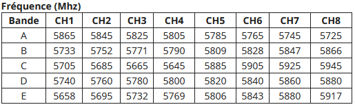

# Projet ROINT

# Table of contents

* [Joysticks and motors](#joysticks-and-motors)  
* [Sets up the camera and its module](#settup-of-the-camera-and-its-module)

## Joysticks and motors

### Joysticks 

**Joystick 1**  

Initially, the values are $(X,Y) = (530,500) $ 

* Along X axes : values between 0 and 1023  
* Along Y axes : values between 0 and 1023    

**Joystick 2**  

Initially, the values are $(X,Y) = (?,564) $ 

* Along X axes : values between 0 and 1023  
* Along Y axes : values between 0 and 1023 

**Coordinates :**   
* **$(X,Y) = (0,500)$** : joystick is on the **right**
* **$(X,Y) = (1023,500)$** : joystick is on the **left**  

* **$(X,Y) = (530,0)$** : joystick is on the **top**
* **$(X,Y) = (530,1023)$** : joystick is on the **bottom**  

For more information check on the website [joystick](https://whadda.com/product/xy-joystick-module-2-pcs-wpi315/)  

### Quantization

The motors take as input an integer between 0 and 255. Hence, we have to adjust the values $v \in [0,1023]$ into a number $n \in [0,255]$.  
For that, we use the method *map()*.  

#### Function *Map()* :

**Defintion :** Re-maps a number from one range to another. That is, a value of fromLow would get mapped to toLow, a value of fromHigh to toHigh, values in-between to values in-between, etc.  

```cpp
    map(value, fromLow, fromHigh, toLow, toHigh)
```

* `value` : the number to map  
* `fromLow` : the lower bound of the value’s current range  
* `fromHigh` : the upper bound of the value’s current range  
* `toLow` : the lower bound of the value’s target range  
* `toHigh` : the upper bound of the value’s target range  

**Example**  

```cpp
    /* Map an analog value to 8 bits (0 to 255) */
    void setup() {}

    void loop() {
      int val = analogRead(0);
      val = map(val, 0, 1023, 0, 255);
      analogWrite(9, val);
    }
```

All information comes from [arduino map()](https://docs.arduino.cc/language-reference/en/functions/math/map/) 

### Motors and rotation direction
Hence, with the mapped value, we can deduce the velocity and the rotation direction for one motor.  
For controling one motor, we use only the vertical direction of the joystick *ie* the $Y$ axes.  
So we have : 

$$
Rotationdirection = \begin{cases} 
   Counter clockwise & \text{if } Y < 500 \\
   Clockwise & \text{if } Y > 500 
\end{cases}
$$

```cpp
void rotationDirection(int y, int Y_joy, int PIN_SENS){
  if (y < Y_joy ){
    digitalWrite(PIN_SENS, LOW); //Counter clockwise rotation direction
  }else{
    digitalWrite(PIN_SENS, HIGH); //Clockwise rotation direction
  }
}
```
* `y` : is the current position along the y axes of the joystick 
* `Y_joy` : is the inital value of Y of the joystick  
* `PIN_SENS` : is the PIN used to control the rotation direction of a motor  

### Deadzone

The joystick is not perfect. Hence, it never fully returns to its original position. i.e., when you release the joystick, it will not always return to $(X,Y) = (530,500)$.
As a result, a wheel could continue to rotate even if it is not desired.
To avoid this, we create a deadzone: if the value of $Y$ is within the interval $[\alpha, \beta]$, the return value is set to 0. This is known as a **threshold function**. 

```cpp
int thresholdFunction(int x, int lowerBound, int upperBound) {
  if (x > lowerBound) {
    return 0;  // If x is greater than the lowerBound return 0
  } else if (x < upperBound) {
    return 0;  // If x is lower than the upperbound return 0
  } else {
    return 1;  // Else return 1
  }
}
```
We have to adjust the boundaries of the deadzone for each joystick because they do not have the same initial position. 
For example is that case, we choose a deadzone of 10%  of the full range for each joystick :  
```cpp
//Initial value of Y for each joysticks
const int Y_joy1 = 500;
const int Y_joy2 = 564;

//Boundaries for the threshold function
const int upperBound_joy1 = Y_joy1 + ceil(1023*0.01);
const int lowerBound_joy1 = Y_joy1 - ceil(1023*0.01);

const int upperBound_joy2 = Y_joy2 + ceil(1023*0.01);
const int lowerBound_joy2 = Y_joy2 - ceil(1023*0.01);
```

## Function *millis()*

**Description** : Returns the number of milliseconds passed since the Arduino board began running the current program. This number will overflow (go back to zero), after approximately 50 days.  

In every function, we find the following structure :  
```cpp
    unsigned long currentMillis = millis();  
    const unsigned long period = 500;  

    static unsigned long previousMillis = 0;
    if(currentMillis - previousMillis >= period) {
    previousMillis = currentMillis;
    /.../}
```

This structure allows us to choose when we want to execute the methode (fix period) without stopping all the program (contrary to the *delay()* function). Let's introduce all the parameters :  

* `currentMillis` = corresponds to the current time since the program has started.  
* `previousMillis` = refers to the last time the function was called.  
* `period` = corresponds to the choosen period (here 500ms).  

Hence, by taking the difference between *currentMillis* and *previousMillis*, we know the time that has elapsed since the last iteration of the function. If this time is greater than the period, we execute the function.  

**What is the difference with the *delay* function**  

The *delay* function is stopping all the program during a choosen value :
```cpp
    delay(1000)
```
*Exemple : stop the program during 1000ms*  

This function is not suitable for our case because we do not want to stop the process because in the mean time, the code is used for controling the robot, the lights and the camera.    

For more information check on the website [arduino.cc/millis](https://docs.arduino.cc/language-reference/en/functions/time/millis/)  


## Settup of the camera and its module

### Connection and first step

In order to supply power to the camera module, it must be powered up to at least 12V and 300mA, which give us a power of 3W (higher than the recommanded value).

When supplied, the module displays different number, follow the next indication : 


* **Press and hold** the button to enter the parameter settings.
* **Press and hold** the button, the digital display will show the alphabet for the band **(A-b-C-d-E)**, **press the button** to select the bands.
* **Press and hold** the button again. When the digital display shows the Arabic numerals for the channel (1-8), **press** the button to select the channels.
* Finally, **press and hold** down the button, VTX returns to its normal operating state and the band, channel and frequency will in turn be displayed on the digital display.

Fix the band and channel in function of this table to allow the screen to be at the same frequency as the module : 
 


## Code integration in ATMega 328p from Arduino UNO board

### Preamble 

To ensure that the correct version of Arduino IDE is installed, check-up if you're using the *1.8.19*.
First, be sure to test your code on Arduino UNO before testing it with ATMega 328p.

### Setting up the library

The library that provides access to programming directly on ATMega 328 is not necessarily directly installed on the Arduino IDE.

To check, go to **Arduino IDE** > **Tools** > **Board Type**. If *MiniCore* does not appear in the possible choices, it is not installed. Here's how to install it : 

* Open the **File** > **Preferences** menu item.
* Enter the following URL in **Additional Boards Manager URLs**:
```bash
https://mcudude.github.io/MiniCore/package_MCUdude_MiniCore_index.json
```
* Open the **Tools** > **Board** > **Boards Manager...** menu item.
* Search for **MiniCore**, click on it and **install**.
* After installation is complete, close the **Boards Manager** window. 

References :  
* [Minicore] (https://github.com/MCUdude/MiniCore?tab=readme-ov-file#how-to-install)     
* [ArduinoISP] (https://docs.arduino.cc/built-in-examples/arduino-isp/ArduinoISP/?queryID=undefined)  

### Code integration

First, you need to define your Arduino board as an ISP programmer:

* Open the **File** > **Examples** > **11.ArduinoISP** > **ArduinoISP**.
* **Upload** it. Be sure to select the correct PORT and **AVRISP mkll** programmer.
* Your Arduino UNO is ready for use !

The ICSP cable must now be wired, and we need to define the various features of our ATMega 328P in the IDE: 

* Go to **Tools** > **Board Type** > **MiniCore** > **ATMega328**
* Open **Tools** again and select **Clock** > **Internal 8 MHz**
* BOD > **BOD Disabled**
* EEPROM > **EEPROM retained**
* Compiler LTO > **LTO disabled**
* Variant > **328P/328PA**
* Bootloader > **No Bootloader**
* PORT > **COM** ***X*** **(Arduino UNO)**
* Programmer > **Arduino as ISP (Minicore)**

Before sending any code, you have to burn the initialization sequence by selecting **Tools** > **Burn bootloader**.

You can now upload your code on your ATMega328P.